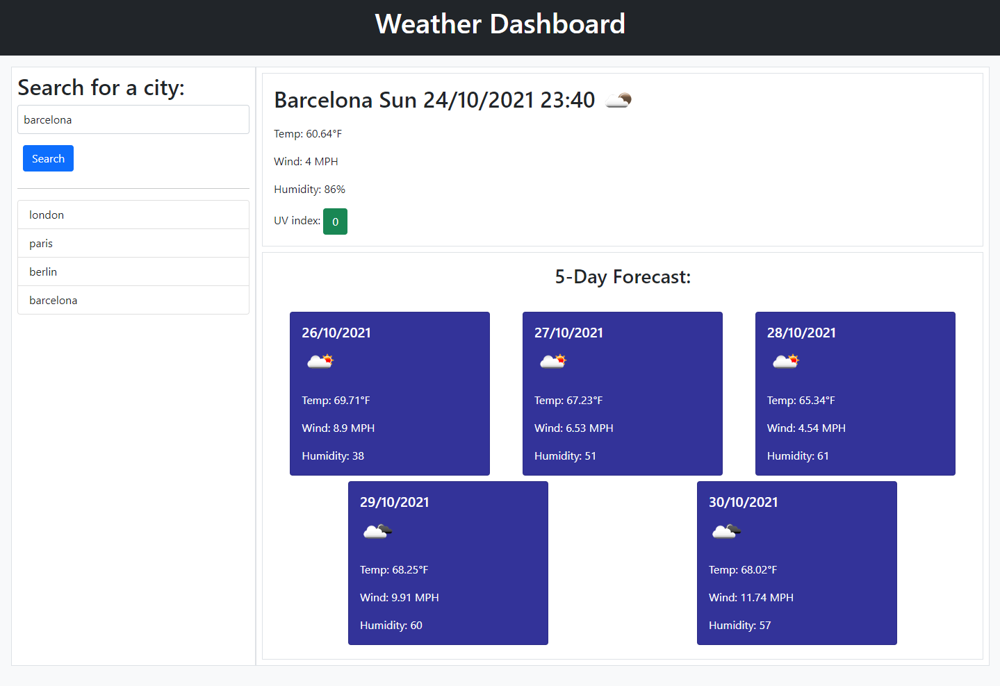
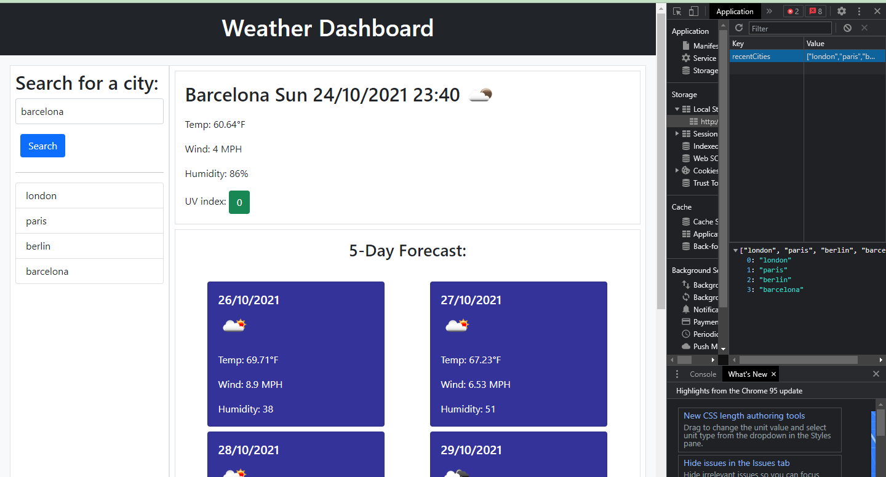

# WEATHER DASHBOARD (COMPLETE)

## PROJECT DESCRIPTION

Objective was to create a weather dashboard that runs in the browser and features dynamically updated HTML and CSS. Whilst using
an API to retrieve real time weather data for a current and predicted 5 day forecast.

## LINK TO WORKING PAGE

Click [here](https://lenny-g.github.io/weather-dashboard/) for finished webpage

## SCREENSHOTS

This is a screenshot of the working webpage.

This is a screenshot of the local storage holding previous data.

## WORK ACHIEVED :

- Created a weather dashboard with multiple cards showing a current forecast and predicted forecast.
- Rendered HTML and CSS in Javascript
- Gather real time data from two APIs
